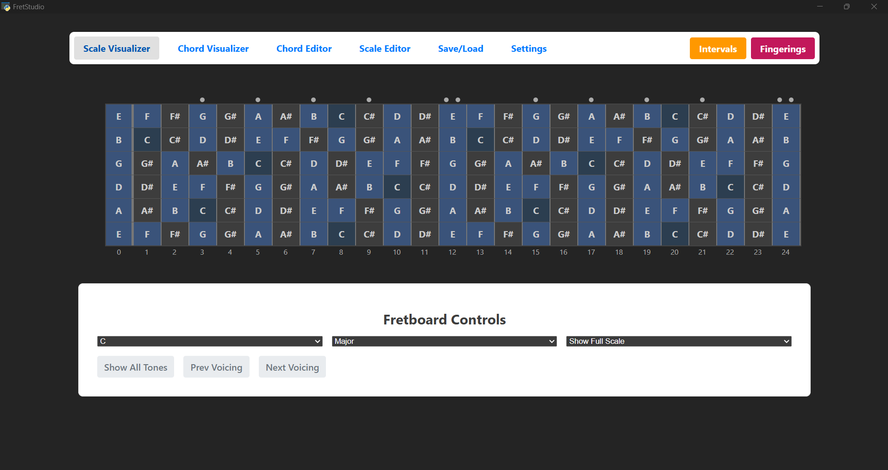
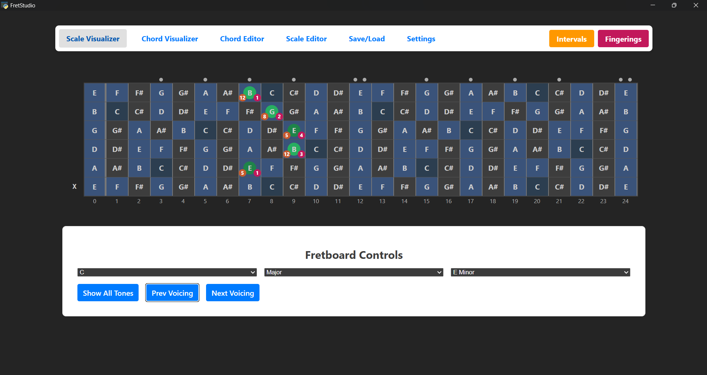
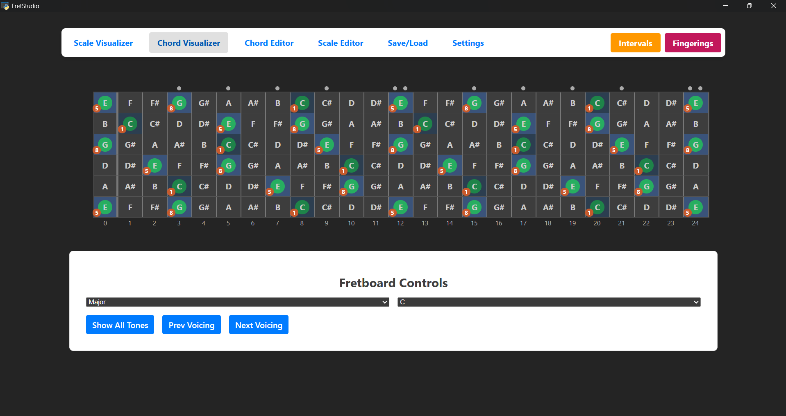
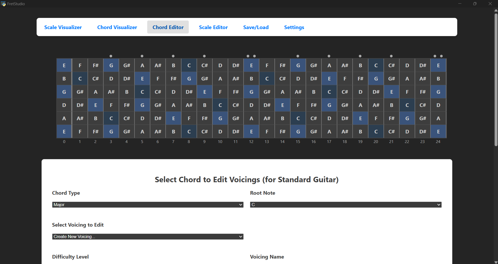

# FretStudio

A comprehensive web-based guitar learning and music theory application that provides interactive fretboard visualization, scale exploration, chord analysis, and custom voicing creation tools.

## 🎸 Features

### Interactive Fretboard Visualization
- **Real-time fretboard rendering** with standard position markers
- **Left/right-handed support** with mirrored layouts
- **Note highlighting** for scales and chords with color-coded patterns
- **Interval display** showing scale degrees and chord tones
- **Interactive fingering editor** with clickable fret positions

### Music Theory Tools
- **Scale Visualizer**: Explore musical scales across the fretboard
- **Chord Visualizer**: Analyze chord patterns and voicings
- **Scale Editor**: Create and modify custom musical scales
- **Chord Editor**: Design custom chord voicings with difficulty ratings
- **Diatonic Chord Analysis**: Discover chords that fit within scales

### Data Management
- **Save/Load System**: Export and import custom configurations
- **Factory Reset**: Restore to original content
- **Soft/Hard Load**: Merge or replace existing data
- **Persistent Storage**: Automatic saving of all modifications

### Customization Options
- **Multiple Tunings**: Standard, Drop D, Open tunings, and custom configurations
- **Accidental Preferences**: Choose between sharp (♯) and flat (♭) notation
- **Handedness Settings**: Left or right-handed fretboard orientation
- **Toggle Controls**: Show/hide fingering numbers and interval indicators

## 📸 Screenshots

## 🚀 Technology Stack

### Frontend
- **React 18.2.0** with TypeScript for type-safe component development
- **Vite** for fast development and optimized builds
- **React Router 7.8.2** for client-side routing
- **React Context API** for global state management
- **Vitest** with React Testing Library for comprehensive testing

### Backend
- **FastAPI** for high-performance RESTful API
- **Uvicorn** ASGI server with hot reload
- **Pydantic** for data validation and serialization
- **JSON file storage** for data persistence

## 📋 Prerequisites

- **Node.js** (version 16 or higher)
- **npm** or **yarn** package manager
- **Python** (version 3.8 or higher)
- **pip** package manager

## 🛠️ Installation & Setup

### Backend Setup

1. **Navigate to the backend directory:**
~~~bash
cd FretStudioBackend
~~~
2. **Create a virtual environment:**
~~~bash
python -m venv venv
~~~
On Windows:
~~~bash
venv\Scripts\activate
~~~
On macOS/Linux:
~~~bash
source venv/bin/activate
~~~
3. **Install the required packages:**
~~~bash
pip install -r requirements.txt
~~~
4. **Run the FastAPI server:**
~~~bash
python FretStudioBackend.py
~~~

The API will be available at `http://127.0.0.1:8000`

### Frontend Setup

1. **Navigate to the frontend directory:**
~~~bash
cd FretStudioFrontend
~~~
2. **Install the dependencies:**
~~~bash
npm install
~~~
3. **Start the development server:**
~~~bash
npm run dev
~~~

The application will be available at `http://localhost:62188`

## To Run Native App

1. **Navigate to the frontend directory:**
~~~bash
cd FretStudioFrontend
~~~

2. **Run npm build:**

~~~bash
npm run build
~~~

3. **Navigate to the backend directory:**

~~~bash
cd ../FretStudioBackend
~~~

4. **Enable virtual environment:**
~~~bash
venv\Scripts\activate
~~~

5. **Build the frontend:**

~~~bash
python build_frontend.py
~~~

6. **Build the backend:**
~~~bash
python build_desktop.py
~~~

7. **Run the native app:**
~~~bash
python desktop_app.py
~~~

## 🔗 API Endpoints

### Save/Load Data Management
- `GET /save-load/all-data` - Export all application data
- `POST /save-load/generate-file` - Generate filtered export file
- `POST /save-load/hard-load` - Replace all data from file
- `POST /save-load/soft-load` - Merge data from file
- `POST /save-load/factory-reset` - Restore factory defaults

### Tuning Management
- `GET /tunings` - Get all guitar tunings
- `POST /tunings` - Create/update tuning
- `DELETE /tunings/{tuning_name}` - Delete tuning
- `POST /tunings/reorder` - Reorder tunings

### Scale Management
- `GET /scales` - Get all musical scales
- `POST /scales` - Create/update scale
- `DELETE /scales/{scale_name}` - Delete scale
- `POST /scales/reorder` - Reorder scales
- `GET /scales/{root_note}/{scale_name}/chords` - Get diatonic chords

### Chord Type Management
- `GET /chord-types` - Get all chord types
- `POST /chord-types` - Create/update chord type
- `DELETE /chord-types/{type_name}` - Delete chord type
- `POST /chord-types/reorder` - Reorder chord types
- `GET /notes/{root_note}/{chord_type_name}` - Get chord notes

### Voicing Management
- `GET /voicings/{tuning}/{chord_type}/{root_note}` - Get chord voicings
- `POST /voicings/{tuning}/{chord_type}/{root_note}` - Create/update voicing
- `DELETE /voicings/{tuning}/{chord_type}/{voicing_name}` - Delete voicing
- `POST /voicings/reorder` - Reorder voicings

### Fretboard Visualization
- `GET /fretboard/visualize-scale` - Generate scale fretboard layout
- `GET /fretboard/visualize-chord` - Generate chord fretboard layout

## 🧪 Testing

### Frontend Testing
~~~bash
cd FretStudioFrontend npm run test
~~~
### Backend Testing
~~~bash
cd FretStudioBackend pytest
~~~

## 🏗️ Build for Production

### Frontend Build
~~~bash
cd FretStudioFrontend npm run build
~~~

### Preview Production Build
~~~bash
cd FretStudioFrontend npm run preview
~~~

## 📁 Project Structure
FretStudio/  
├── FretStudioBackend/  
│   ├── FretStudioBackend.py  
│   ├── requirements.txt  
│   ├── chord_types.json  
│   ├── scales.json  
│   ├── tunings.json  
│   ├── voicings_library.json  
│   ├── factory_library.json  
│   ├── tests/  
│   │   ├── test_main.py  
│   │   └── __init__.py  
│   └── venv/  
├── FretStudioFrontend/  
│   ├── src/  
│   │   ├── components/  
│   │   │   ├── Fretboard.tsx  
│   │   │   ├── Fretboard.css  
│   │   │   ├── Selector.tsx  
│   │   │   └── Selector.css  
│   │   ├── contexts/  
│   │   │   ├── AccidentalTypeContext.tsx  
│   │   │   ├── FingeringVisibilityContext.tsx  
│   │   │   ├── HandednessContext.tsx  
│   │   │   ├── IntervalVisibilityContext.tsx  
│   │   │   └── TuningContext.tsx  
│   │   ├── pages/  
│   │   │   ├── ScaleVisualizer.tsx  
│   │   │   ├── ScaleVisualizer.css  
│   │   │   ├── ChordVisualizer.tsx  
│   │   │   ├── ChordVisualizer.css  
│   │   │   ├── ChordEditor.tsx  
│   │   │   ├── ChordEditor.css  
│   │   │   ├── ScaleEditor.tsx  
│   │   │   ├── ScaleEditor.css  
│   │   │   ├── SaveLoadPage.tsx  
│   │   │   ├── SaveLoadPage.css  
│   │   │   ├── Settings.tsx  
│   │   │   └── Settings.css  
│   │   ├── utils/  
│   │   │   └── noteUtils.ts  
│   │   ├── __tests__/  
│   │   │   └── App.test.tsx  
│   │   ├── apiService.ts  
│   │   ├── test-utils.tsx  
│   │   ├── setupTests.ts  
│   │   ├── App.tsx  
│   │   ├── App.css  
│   │   ├── main.tsx  
│   │   └── index.css  
│   ├── dist/  
│   ├── public/  
│   ├── node_modules/  
│   ├── package.json  
│   ├── package-lock.json  
│   ├── vite.config.ts  
│   ├── tsconfig.json  
│   ├── tsconfig.app.json  
│   ├── tsconfig.node.json  
│   ├── eslint.config.js  
│   ├── index.html  
│   ├── CHANGELOG.md  
│   └── README.md  
├── .git/  
├── .gitignore  
└── README.md  

## 🎯 Usage Examples

### Creating a Custom Scale
1. Navigate to the **Scale Editor** page
2. Enter a scale name and select intervals
3. Choose compatible chord types
4. Save the scale for use across the application

### Adding Custom Chord Voicings
1. Go to the **Chord Editor** page
2. Select a chord type and root note
3. Click frets on the interactive fretboard to create fingering patterns
4. Set difficulty level and save the voicing

### Exploring Scale-Chord Relationships
1. Use the **Scale Visualizer** to select a scale
2. View diatonic chords that fit within the scale
3. Switch to **Chord Visualizer** to analyze individual chord patterns

## 🤝 Contributing

1. Fork the repository
2. Create a feature branch (`git checkout -b feature/amazing-feature`)
3. Commit your changes (`git commit -m 'Add amazing feature'`)
4. Push to the branch (`git push origin feature/amazing-feature`)
5. Open a Pull Request

## 📜 License

This project is licensed under the MIT License - see the LICENSE file for details.

## 🙏 Acknowledgments

- Built with modern web technologies for optimal performance
- Designed for guitarists of all skill levels
- Emphasizes music theory education through interactive visualization